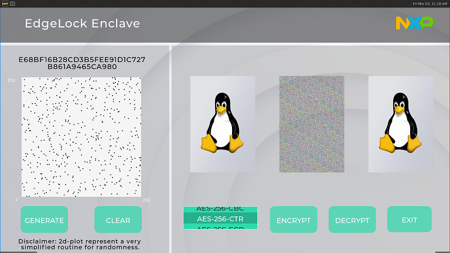

# EdgeLock Enclave (ELE) demo for i.MX93

## 1.Introduction
The EdgeLock Enclave (ELE) is an independent security domain that provides security services, which include key management, random number generation, data storage, execution of cryptographic services, etc.

This application is developed to make some of the ELE functionalities visible.  

Current supported devices:
- i.MX93EVK + 1080P monitor

## 2.User guide

Currently, this demo has 3 functions: random number generation(RNG), AES encryption and decryption, and data storage.



### 2.1 RNG

For this function, there are 4 elements in the UI screen from the top to bottom:
- A text box 
    - showing 20 bytes of consecutive random numbers
- A 2d-plot
    - where the dot's position is generated by ELE RNG
- A generate button
    - press to generate 200 bytes of random number, add 100 pairs of dots into the 2d-plot and update the text box with the first 20 bytes
- A clear button
    - press to clear all the dots in the 2d-plot and text box

Press **GENERATE** to generate 200 bytes random numbers. Then, the 2d-plot and text box will be updated.

Press **CLEAR** to clear all the dots in the 2d-plot and the text box.

### 2.2 AES crypto

The main idea for this function is to show that ELE has AES crypto feature. There are mainly 4 elements:
* 3 pictures
	* the first one is the original image
	* the second is encrypted image
	* the third is decrypted image
* A mode select bar
	* select one of the AES mode:
		* AES-256-ECB/CBC/CTR
* A encrypt button
* A decrypt button

Select one of the AES mode and press **ENCRYPT** button. There will be a window popping out to set your password. Input your password and click **OK** in that window. The second image will be updated when the encryption is finished.

Press **DECRYPT** button to decrypt the encrypted image. There will be a window popping out for confirming your password which is set before. If the password is verified, the third image will be updated. Otherwise, there will be a warning that the password is wrong.

### 2.3 Data storage

This demo uses data storage of ELE to store the password's hash of AES crypto. The SHA-256 hash value of the password is stored by ELE when the image is encrypted. The hash value will be verified when the image is decrypted.

## 3.Build instructions

### 3.1 Clone this repo:

```bash
git clone --recurse-submodules [repo_url]
cd imx-ele-demo
```

### 3.2 Set the environment

This example is using linux 6.1-langdale for i.MX93
```bash
source /opt/fsl-imx-internal-xwayland/6.1-langdale/environment-setup-armv8a-poky-linux
```

### 3.3 Build

make [imx-secure-enclave](https://github.com/nxp-imx/imx-secure-enclave) library and apply patch for lvgl first
```bash
cd /path/to/imx-secure-enclave
make PLAT=ele
export ELE_ROOT=/path/to/imx-secure-enclave

PROJDIR=$(pwd)
cp -rf $PROJDIR/protocols/ $PROJDIR/lv_drivers/wayland/

cd $PROJDIR/lv_drivers
git apply $PROJDIR/misc/patch/0001-fix-wayland-busy-flush-and-add-wm_capabilities.patch
```

Then move to project directory and make
```bash
cd $PROJDIR
make -j32
```

### 3.4 Download binary file to board

- `bin/eledemo`

### 3.5 run

make sure the nvm_daemon is started and run the binary

```bash
systemctl start nvm_daemon
./eledemo
```

## 4.Trouble shooting

If the application could not be started, please make sure the nvm_daemon is started and:
```bash
rm /etc/ele/* -rf
```
Then reboot the device by **power button** switch rather Linux command `reboot`.